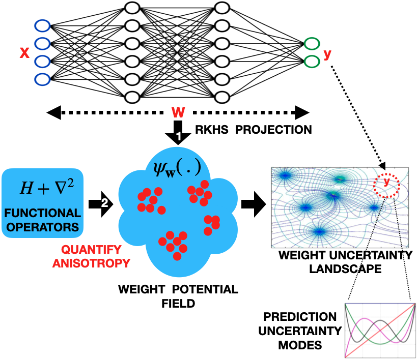

<!-- -----
layout: page
title: "A Functional Operator for Model Uncertainty Quantification in the RKHS: The QIPF"
-----
 -->

 <h1> <ins>A Functional Operator for Model Uncertainty Quantification in the RKHS: The QIPF</ins> </h1> 

<!-- 

<ins>RKHS based Physical Interpretation of Model Uncertainty: The QIPF</ins>

=== -->

<figure>

<figcaption align = "center"><b>Approach: Moments extracted from the local interaction of the model output with the RKHS potential field of the weights quantify the output uncertainty.</b></figcaption>
</figure>

    
 Abstract 

We propose a fast single-shot uncertainty quantification framework where, instead of working with the conventional Bayesian definition of model weight probability density function (PDF), we utilize functional operators (inspired by physics) over the projection of model weights in a reproducing kernel Hilbert space (RKHS) to quantify their uncertainty at each model output. The RKHS projection of model weights yields a potential field based interpretation of model weight PDF which consequently allows the definition of a functional operator, inspired by perturbation theory in physics, that performs a moment decomposition of the model weight PDF (the potential field) at a specific model output to quantify its uncertainty. We call this representation of the model weight PDF as the quantum information potential field (QIPF) of the weights. The extracted moments from this approach automatically decompose the weight PDF in the local neighborhood of the specified model output and determine, with great sensitivity, the local heterogeneity of the weight PDF around a given prediction. These moments therefore provide sharper estimates of predictive uncertainty than central stochastic moments of Bayesian methods. Experiments evaluating the error detection capability of different uncertainty quantification methods on covariate shifted test data show our approach to be more precise and better calibrated than baseline methods, while being faster to compute.

 
    
## Goal:
Consider a $k$-class classification problem with training dataset $$\mathbf{D} = \{x_{i}, y_{i}\}_{i=1}^N$$ consisting of $d$-dimensional input vectors $x_i \in \mathbb{R}^d$ and the corresponding target labels $y_i \in \{1...k\}$. Assume that a point-prediction neural network with weights $\mathbf{w}$ learns an implicit distribution $p(y|x, \mathbf{w})$ and its output corresponding to a test input $$x^*$$ is $$y^*$$. **Our goal is to come up with a pseudo-probability (or uncertainty) measure for the true implicit posterior predictive PDF $$p(y^*|x^*, \mathbf{w})$$.**
 
 
The problem is further made challenging by covariate shift of the test-set so that underlying distribution of input test data changes from $p(x|\lambda)$ during training to $p(x^*|\gamma)$ during testing (where $\lambda$ and $\gamma$ are parameters of the underlying distributions), while the target conditional distribution remains the same, i.e. $$p(y|x) = p(y^*|x^*)$$.

 

## Approach: 
A Bayesian approach to accomplish this involves methods for approximating the posterior predictive PDF of the model (a problem of marginalization over weights): $$p(y^*|x^*, \mathbf{D}) = \int{p(y^*|x^*, \mathbf{w})p(\mathbf{w}|\mathbf{D})d\mathbf{w}}$$. Our approach, on the other hand, involves quantifying the local gradient flow (heterogeneity) of $$p(y^*|x^*, \mathbf{w})$$. In other words, we quantify how optimized the weights $\mathbf{w}$ are to make predictions in the vicinity of $$y^*$$. This is achieved through the following three steps:
 
 
$$\mathbf{1}$$.   The first step is the projection (mean embedding) of weights in a Gaussian RKHS to estimate the implicit weight PDF: $$p(y^*|x^*, \mathbf{w}) \approx \psi_{\mathbf{w}}(y^*) = \frac{1}{n}\sum_{t=1}^{n}G_\sigma(w_t, y^*)$$.

---

$$\mathbf{2}$$.  The next step involves quantification of local gradient flow of $$p(y^*|x^*, \mathbf{w})$$ using Laplacian operator based formulation: $$\nabla_y^2\psi_\mathbf{w}(y^*) \approx p(y^* + \Delta{y^*}|x^*, \mathbf{w}) - p(y^*|x^*, \mathbf{w})$$.
 
 
Inspired by quantum mathematics we propose to use the Schrodinger’s equation, which includes the Laplacian of the wave-function, to estimate the local gradient flow of $\psi_\mathbf{w}$. Unlike quantum mechanics that utilizes a Hilbert space, we estimate the solution in an RKHS, with the great advantage that we can use the kernel trick to compute the solution in the input space, directly from samples. The local gradient flow of $$p(y^*|x^*, \mathbf{w})$$ can therefore be represented as a Hamiltonian (a function measuring the rate of change), $$H_0$$ at $$y^*$$ given by:
 
 
$$H_0(y^*) = E_\mathbf{w}(y^*) + (\sigma^2/2)\frac{\nabla_y^2\psi_\mathbf{w}(y^*)}{\psi_\mathbf{w}(y^*)}$$ 
    
---
    
$$\mathbf{3}$$. The final step is the moment decomposition of the PDF gradient flow (i.e. $$\nabla_y^2\psi_\mathbf{w}(y^*) = \psi_\mathbf{w}^0(y^*) + \lambda\psi_\mathbf{w}^1(y^*) + \lambda^2\psi_\mathbf{w}^2(y^*) + ...$$) for high resolution information extraction of heterogeneity around $$y^*$$ (which quantifies uncertainty). This is achieved via solution of $$H_0$$ (in step 2) in terms of its intrinsic moments as follows:
 
 
$$H_0^k(y^*) = E_\mathbf{w}^k(y^*) + (\sigma^2/2)\frac{\nabla_y^2\psi_\mathbf{w}^k(y^*)}{\psi_\mathbf{w}^k(y^*)}$$  &nbsp; &nbsp; &nbsp; &nbsp; &nbsp; (Visit [paper 1](https://arxiv.org/abs/2109.10888) and [paper 2](https://arxiv.org/abs/2001.11495) for derivation and more details!)
 
 
Here, $k$ denotes moment index. 
 
 
$$\mathbf{H_0^0(y^*), H_0^1(y^*), H_0^2(y^*) ...}$$ **are the functional measurements at $$\mathbf{y^*}$$ corresponding to different degrees of heterogeneity of model PDF (in terms of its gradient) at $$\mathbf{y^*}$$, therefore representing successive local moments of model uncertainty (called QIPF moments) at the model's prediciton point.**

---
    
## Results: 
<figure>

<figcaption align = "center"><b>(a) QIPF modes of a sine-wave in data space. Tail regions of the PDF are seen to be efficiently quantified by QIPF modes. (b, c): Model uncertainty: (b) shows the high sensitivity of the QIPF with respect to model’s seen and unseen data regions. (c) shows it to be well calibrated with model’s regularization.</b></figcaption>
</figure>
    
 
    
<figure>

<figcaption align = "center"><b>MNIST illustrative example: (a) shows the histograms of uncertainty estimates where QIPF can be seen to achieve better class-separation between correct and wrong predictions (very low overlap). (c) and (d) show corresponding error detection ROC and precision-recall curves, (e), (f) and (g) show the graphs of ROC-AUC, PR-AUC and PT-Biserial Corr. vs noise internsity. QIPF framework can be seen to have better performance.</b></figcaption>
</figure>
 
 
    
## Computational Cost Discussion:
The computational parts involved in implementing the QIPF framework are the following:
    1. Computation of the IPF, $$\psi_\mathbf{w}(y^*)$$, whose computational time grows linearly with the size of the weight vector, $$\mathbf{w}$$.
    2. Extraction of QIPF modes (involving hermite polynomial projections of $$\psi_\mathbf{w}(y^*)$$) whose computational time grows linearly with the number of modes.

The time complexity of the QIPF framework is therefore approximately $$\mathbf{O}(n+m)$$ where n and m are the number of weights and number of modes respectively. In practice, we do average pooling of weights thereby considerably reducing the effective number of weights used for QIPF implementation. Further, at maximum, we only extract about 20 QIPF modes thereby limiting m to a small value. This makes the QIPF framework considerably faster than Bayesian approaches. This is evident from the run-time comparisons of QIPF with MC-dropout in our experiments as shown in the following table.

<figure>

<figcaption align = "left"><b>Computational time analysis.</b></figcaption>
</figure>

## Related Papers:
Singh, R. and Principe, J.C., 2021. **Quantifying Model Predictive Uncertainty with Perturbation Theory**. (Under Review) [(Paper Link)](https://arxiv.org/abs/2109.10888)

 Abstract 

 
We propose a framework for predictive uncertainty quantification of a neural network that replaces the conventional Bayesian notion of weight probability density function (PDF) with a physics based potential field representation of the model weights in a Gaussian reproducing kernel Hilbert space (RKHS) embedding. This allows us to use perturbation theory from quantum physics to formulate a moment decomposition problem over the model weight-output relationship. The extracted moments reveal successive degrees of regularization of the weight potential field around the local neighborhood of the model output. Such localized moments represent well the PDF tails and provide significantly greater accuracy of the model's predictive uncertainty than the central moments characterized by Bayesian and ensemble methods or their variants. We show that this consequently leads to a better ability to detect false model predictions of test data that has undergone a covariate shift away from the training PDF learned by the model. We evaluate our approach against baseline uncertainty quantification methods on several benchmark datasets that are corrupted using common distortion techniques. Our approach provides fast model predictive uncertainty estimates with much greater precision and calibration.

    
 
    
Singh, R. and Principe, J.C., 2021. **Toward a Kernel-Based Uncertainty Decomposition Framework for Data and Models**. Neural Computation, 33(5), pp.1164-1198. [(Paper Link)](https://arxiv.org/abs/2001.11495) 

 Abstract 

 
This letter introduces a new framework for quantifying predictive uncertainty for both data and models that relies on projecting the data into a gaussian reproducing kernel Hilbert space (RKHS) and transforming the data probability density function (PDF) in a way that quantifies the flow of its gradient as a topological potential field (quantified at all points in the sample space). This enables the decomposition of the PDF gradient flow by formulating it as a moment decomposition problem using operators from quantum physics, specifically Schrödinger's formulation. We experimentally show that the higher-order moments systematically cluster the different tail regions of the PDF, thereby providing unprecedented discriminative resolution of data regions having high epistemic uncertainty. In essence, this approach decomposes local realizations of the data PDF in terms of uncertainty moments. We apply this framework as a surrogate tool for predictive uncertainty quantification of point-prediction neural network models, overcoming various limitations of conventional Bayesian-based uncertainty quantification methods. Experimental comparisons with some established methods illustrate performance advantages that our framework exhibits.

